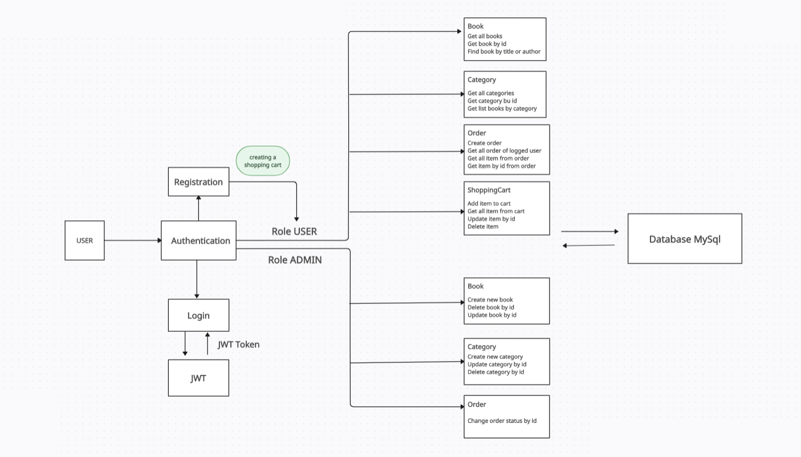

# Bookstore API 📚
Welcome to the Online Bookstore API, a RESTful API designed for managing an online bookstore. It allows users to manage a catalog of books, shopping carts, and orders, and supports user registration and authentication via JWT. The API also includes role-based access control, enabling different levels of access for users and administrators.
## Technologies
- **Java 17**: Core programming language for backend development.
- **Spring Boot**: Framework for building microservices with minimal configuration.
- **Spring Web**: Module for building REST APIs and handling HTTP requests.
- **Spring Security**: Authentication and authorization framework.
- **MySql**: The basis of the database for the project.
- **MapStruct**: Simplifies object mapping between DTOs and entities.
- **Liquibase**: Tool for managing database schema migrations.
- **JUnit & MockMvc**: Frameworks for unit and integration testing.
- **Docker**: Containerization platform for consistent development and deployment environments.
## Features
### Users 👥
- User registration and login.
- JWT-based authentication.
- User roles: USER (regular user) and ADMIN (administrator).
### Books 📚 
- CRUD operations for books: create, read, update, and delete.
- Filter books by categories.
- Search books by title or author.
- Users can only perform GET operations
- Administrator can perform POST, PUT, DELETE operations
### Categories 📂
- Users can view all categories and see all books in a specific category.
- Administrators can add, update, and delete categories.
### Shopping Cart 🛒
- All actions are performed only by authenticated users.
- Add books to the cart.
- View cart contents.
- Update book quantities in the cart.
- Remove books from the cart.
- The user's shopping cart is created during registration
### Orders 📋
- Place orders from the cart (authenticated users only).
- View order history (authenticated users only).
- Users can create an order for their cart.
- Users can retrieve all their orders.
- Users can view all items in a specific order.
- Users can retrieve individual order items by order and product ID.
- Admins can update the status of an order by ID.
## Getting Started 🚀
### Setup
1. **Clone the repository:**
```
git clone https://github.com/vladshender/Online-Book-Store.git
```
2. **Build the project:**
```
mvn clean package
```
3. **Start the application using Docker Compose:**
```
docker-compose up
```
### Connecting to a Custom Database 🗄
To connect to a custom MySQL database, update the application.properties file with your database details:
```
spring.datasource.url=jdbc:mysql://<YOUR_DB_HOST>:<YOUR_DB_PORT>/<YOUR_DB_NAME>
spring.datasource.username=<YOUR_DB_USERNAME>
spring.datasource.password=<YOUR_DB_PASSWORD>
spring.datasource.driver-class-name=com.mysql.cj.jdbc.Driver
spring.jpa.hibernate.ddl-auto=validate
spring.jpa.show-sql=true
server.servlet.context-path=/api

jwt.expiration=<TIME_SESSION_EXPERATION_IN_MS>
jwt.secret=<SECRET_WORD>
```
### You can explore the api through the Swagger UI:
```
http://localhost:8080/api/swagger-ui/index.html
```
## Endpoints
### Authentication
| Method          | Endpoint   |          Role         |     Description                         |
|-----------------|------------|-----------------------|-----------------------------------------|
|  `POST`          | `api/auth/login`       | Unauthorized       |  Login user                          | 
| `POST`         | `api/auth/registration`  | Unauthorized      |    Registration user with password and email  | 
### Book
| Method          | Endpoint   |          Role         |     Description                         | 
|-----------------|------------|-----------------------|-----------------------------------------|
|  `GET`          | `api/books`       | USER               |   Get all book                          |
| `GET`         | `api/books/{id}`     | USER             |    Get book by id                         |
| `POST`        | `api/books`         | ADMIN             |    Сreate a new book                     |
| `DELETE`      | `api/books/{id}`     | ADMIN            |     Delete a book by id                  |
| `PUT`         |  `api/books/{id}`    | ADMIN            |     Update book by id                    |
| `GET`         | `api/books/search`   | USER              |   Search for a book by title or author  |
### Category
| Method          | Endpoint   |          Role         |     Description                         |
|-----------------|------------|-----------------------|-----------------------------------------|
|  `GET`          | `api/categores`       | USER               |   Get all categories             |
| `GET`         | `api/categores/{id}`     | USER             |    Get category by id              | 
| `POST`        | `api/categores`         | ADMIN             |    Сreate a new category             |
| `DELETE`      | `api/categores/{id}`     | ADMIN            |     Delete a category by id           |
| `PUT`         |  `api/categores/{id}`    | ADMIN            |     Update category by id            |
| `GET`         | `api/categores/{id}/books`   | USER              |   Get all books by category id  |        
### Order
| Method          | Endpoint   |          Role         |     Description                         |
|-----------------|------------|-----------------------|-----------------------------------------|
|  `GET`          | `api/order`       | USER               |   Get all orders of the logged in user             |
| `GET`         | `api/order//{id}/items`     | USER             |    Get all items for order by order id              | 
| `GET`        | `api/order/{orderId}/items/{itemId}`| USER      |    Get item for the order by id and product id      |
| `POST`      | `api/order`     | USER            |     Сreating an order for a logged-in user           |
| `PATCH`         |  `api/order/{id}`    | ADMIN            |     Update order status by id            |
### ShoppingCart
| Method          | Endpoint   |          Role         |     Description                         |
|-----------------|------------|-----------------------|-----------------------------------------|
| `GET`         | `api/cart`     | USER             |    Get shopping cart for logging user              | 
| `POST`        | `api/cart`         | ADMIN             |    Create cart items in shopping cart for logging user             |
| `DELETE`      | `api/cart/items/{id}`     | ADMIN            |     Delete cart item by id           |
| `PUT`         |  `api/cart/items/{id}`    | ADMIN            |     Update quantity for cart items by id in shopping cart            |
## Scheme of main interactions and functions in the project 

##
The Bookshop API provides a robust foundation for managing users, books, categories, and orders in an online bookstore. The technology stack provides scalability, security and ease of maintenance. Feel free to contribute or provide feedback to help us improve.
##
<details>
  <summary>Technologies Used</summary>

  - **Java**: Core language for backend development.
  - **Spring Boot**: Framework for rapid microservice development.
  - **Spring Web**: Handles REST API creation and HTTP requests.
  - **Spring Security**: Manages authentication and authorization.
  - **MapStruct**: Automates object mapping between DTOs and entities.
  - **Liquibase**: Manages database schema migrations.
  - **JUnit & MockMvc**: Frameworks for unit and integration testing.
  - **Docker**: Ensures consistent environments through containerization.

</details>
